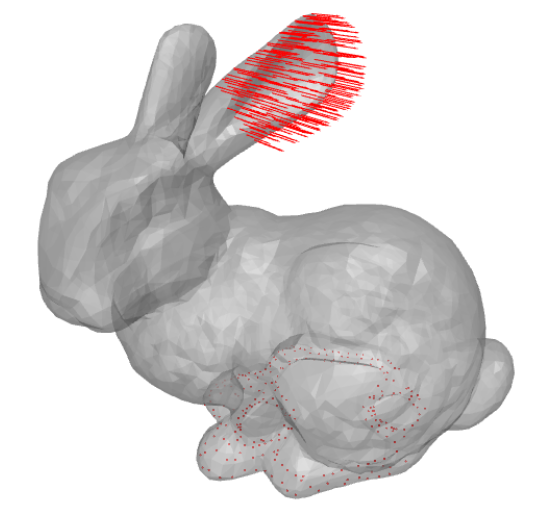
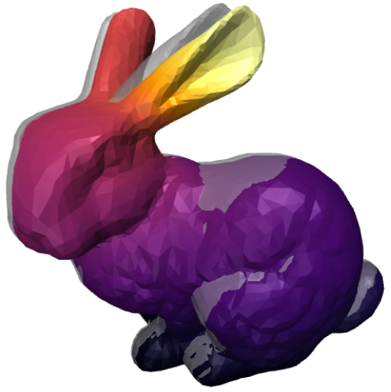

# Approximate Killing Vector Field (AKFV) deformation on meshes

This is a basic `python` implementation of *Approximate Killing vector fields* (AKVFs) to produce near-isometric deformations on meshes of 2D surfaces embedded in 3D.

  
  

This was motivated by the lack of a simple implementation available in `python` with a focus for the code to be close to the theory, easily understandable, runnable and modifiable. The focus is not necessarily on the performance, especially real-time, with the presented example being solved in around a second on a laptop.

Everything except the mesh data is self-contained in the `AKVF.ipynb` notebook.